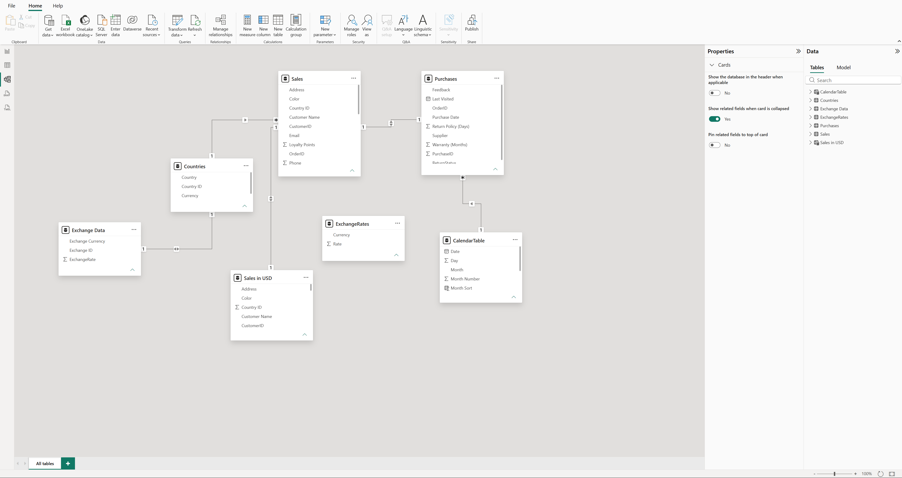
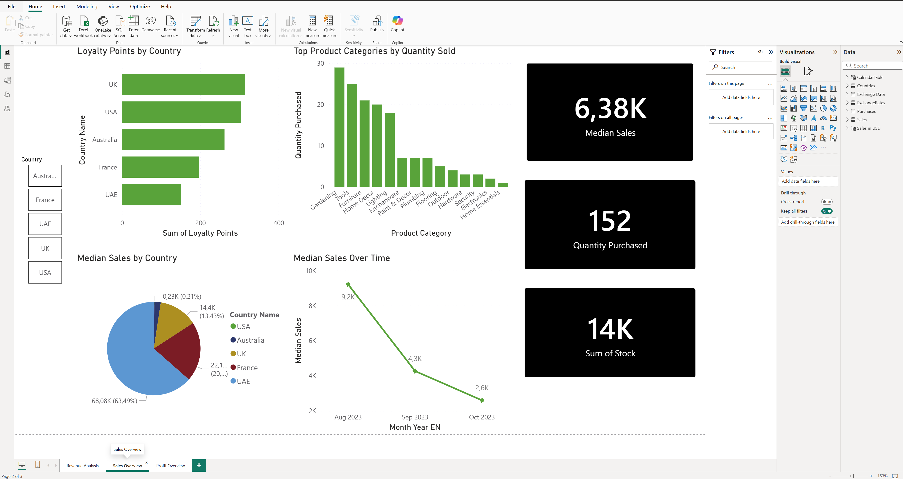
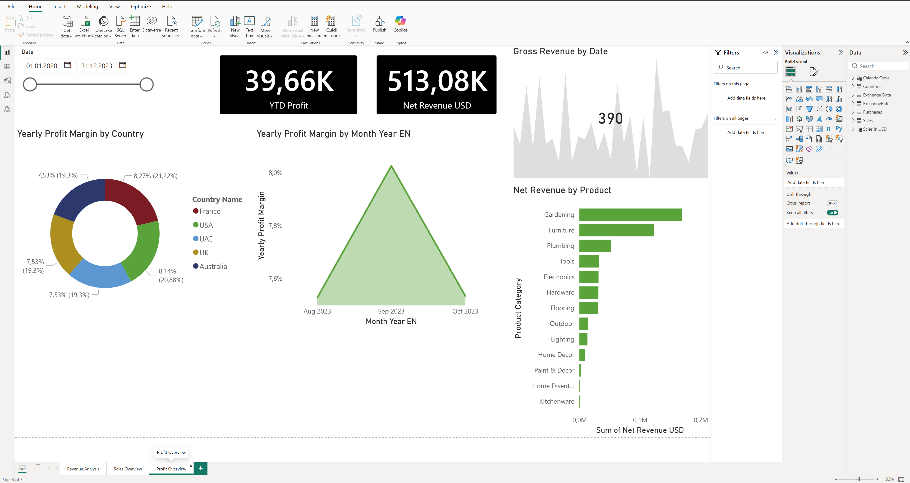
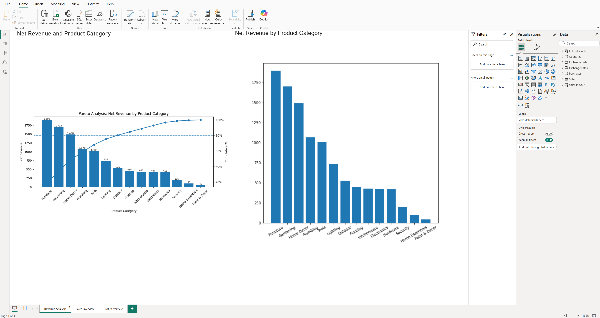

# 📊 Sales Analytics Dashboard (Power BI)

## 📌 Project Overview

This project demonstrates an end-to-end sales analytics workflow using Power BI. The objective was to transform raw sales data into an interactive dashboard that supports KPI monitoring, revenue analysis, profitability analysis, and business decision-making.

---

## 🎯 Business Goal

The goal of this project was to analyze sales performance, identify the most profitable products and categories, monitor revenue trends, and provide actionable business insights through interactive dashboards.

---

## 🛠 Tech Stack

- Power BI
- Power Query
- DAX
- Excel
- Data Modeling

---

## ⚙️ Project Workflow

1. Imported raw sales data from Excel.
2. Cleaned and transformed data using Power Query.
3. Built a Star Schema data model.
4. Created relationships between fact and dimension tables.
5. Developed DAX measures and KPIs.
6. Designed interactive dashboards.
7. Analyzed sales, revenue, and profitability.

---

## 🗂 Data Model

The project uses a Star Schema consisting of fact and dimension tables to improve report performance and simplify analytical calculations.



---

## 📊 Dashboard Pages

### 📈 Sales Overview

Provides an overview of overall sales performance, including revenue, orders, customer activity, and sales trends.



---

### 💰 Profit Overview

Analyzes profit margin, product profitability, and category performance.



---

### 🌍 Revenue Analysis

Explores monthly revenue trends, country performance, and product category contributions.



---

## 📈 Key Business Insights

- Gardening and Furniture generated the highest revenue.
- A small number of product categories generated most of the revenue (Pareto Principle).
- Profit margin peaked in September.
- The UK and USA demonstrated the highest customer loyalty.

---

## 💡 Skills Demonstrated

- Data Cleaning
- Data Transformation
- Data Modeling
- Star Schema Design
- DAX Calculations
- KPI Development
- Business Analysis
- Dashboard Design
- Data Visualization

---

## 📁 Repository Structure

```
Sales-Analytics-Dashboard
│
├── README.md
├── Sales_Analytics_Dashboard.pbix
│
└── Screenshots
    ├── Data_Model.png
    ├── Sales_Overview.png
    ├── Profit_Overview.png
    └── Revenue_Analysis.png
```

---

## 🚀 How to Open

1. Download **Sales_Analytics_Dashboard.pbix**.
2. Open the file using **Microsoft Power BI Desktop**.
3. Explore the interactive dashboard using filters, slicers, and drill-down functionality.

---


